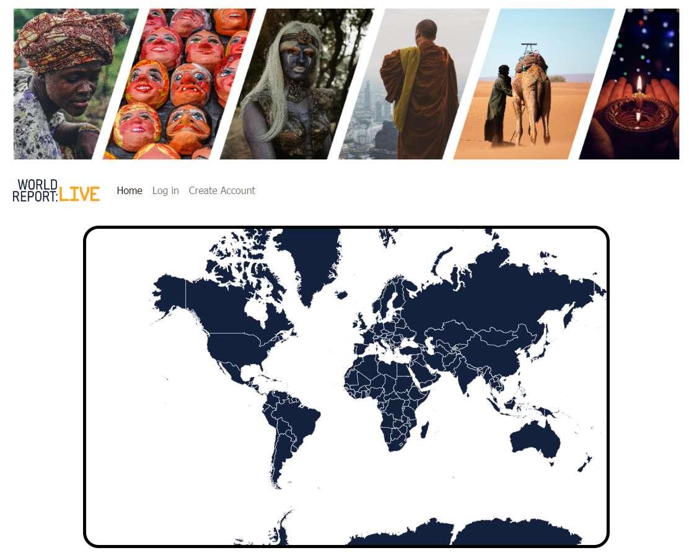
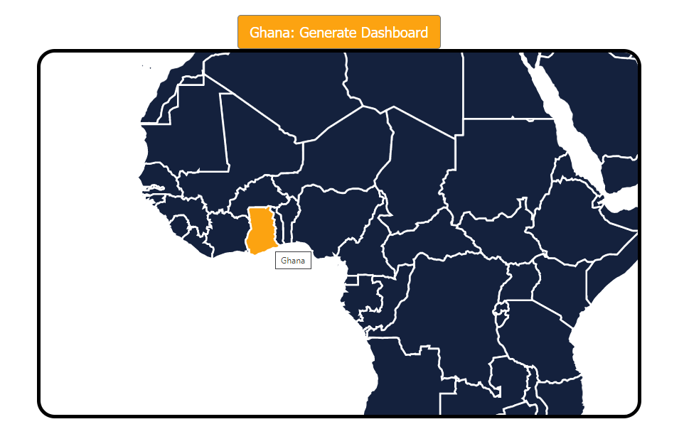
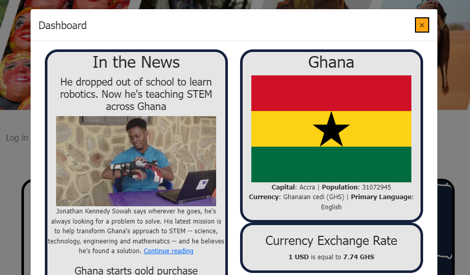

# World Report: Live

### Overview
Welcome to World Report: Live, where the world is just a click away.  Utilizing an interactive world map data visualization, users can explore key information about the world such as breaking news, population, capital city, primary language, and live exchange rates. Create an account or securely sign-in and access your profile. Customize your dashboard to suit your interests: add a search term such as 'bitcoin' or 'Ukraine' to your news search, specify the news source language, or localize the currency exchange rate.

### Tech Stack
- Python, Flask, PostgresQL, SQLAlchemy, Jinja, JavaScript, AJAX, D3.js, HTML, CSS, Bootstrap, RESTful APIs, AWS, OAuth

### Data
Natural Earth - Admin 0 
https://www.naturalearthdata.com/downloads/10m-cultural-vectors/

### Notes
Visit the site at http://www.worldreport.live!

# API Documentation
